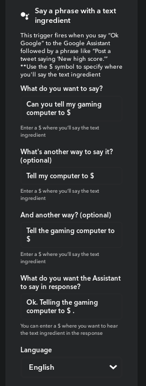
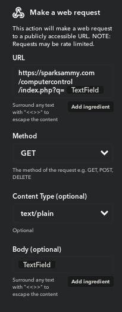

# homeassist
Control your Ubuntu/Pop!_OS computer with IFTTT using Google Home (and other services)

## Tutorial

* Add CONTENTS of "php-files" to a subdirectory in a PHP-compatible webserver (Can be hosted.)
* Add "Figure A" then "Figure B" to IFTTT (text phrases can be differently worded)
* Download the "homeassist" bash script in the root of the master branch.
* Do: sudo apt install -y pm-utils
* Run in same directory as where it's downloaded: chmod +x homeassist
* Edit first line in BASH to match YOUR URL, NOT MINE.
* Run the bash script called "homeassist" USING ROOT

Figure A:

Figure B:

